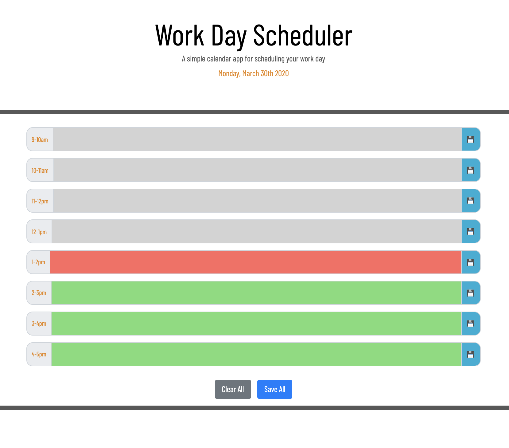
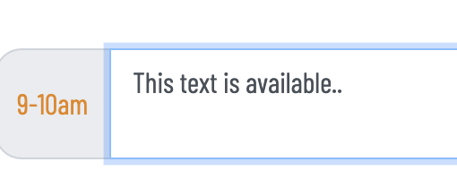
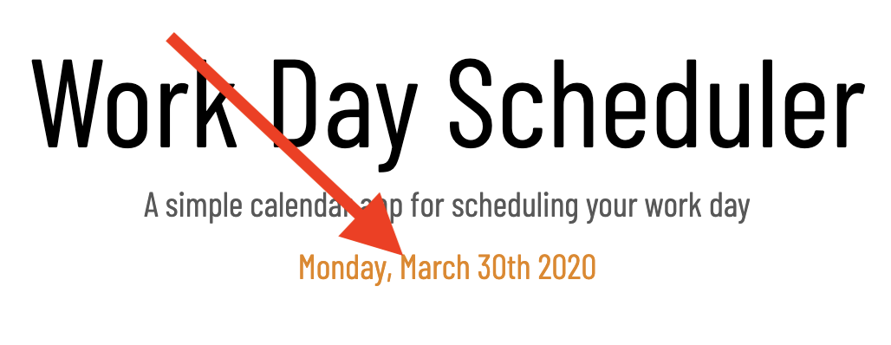
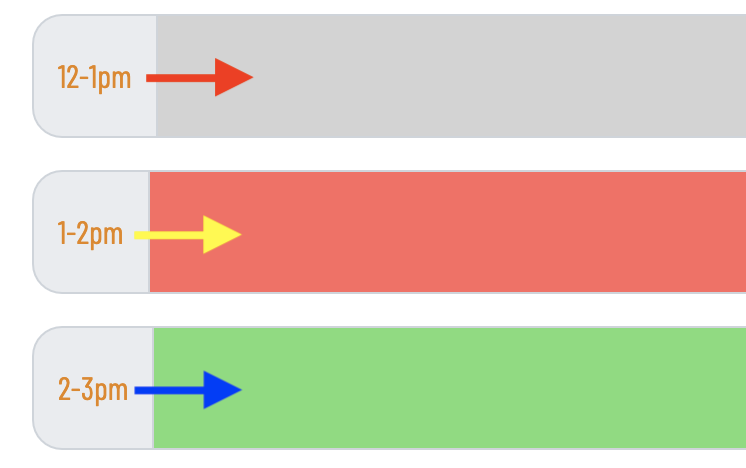
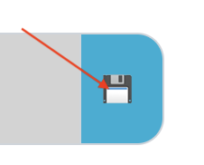
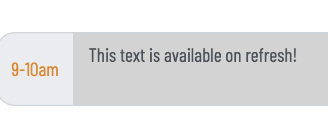
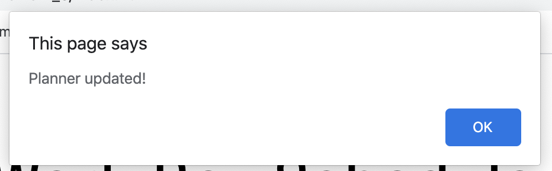
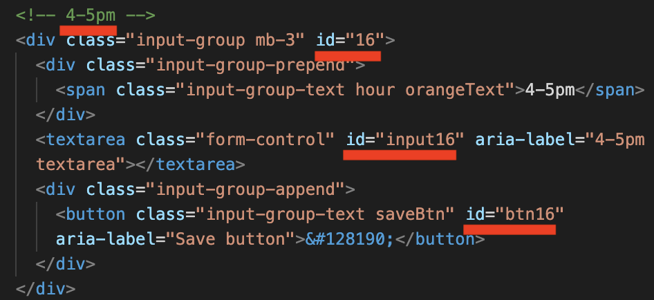

# 05 Third-Party APIs: Work Day Scheduler

<!-- //PURPOSE & FUNCTIONALITY OF APPLET// -->
This applet [(click here)](https://aphan1982.github.io/homework_5/): 



enables a user to schedule events in one-hour timeblocks, much like an average day planner:



When the user opens the app, the date is automatically synchronized using moment.js:



The app compares each timeblock against current time to color code each field gray for past, coral for present, or green for future:



When the save icon next to each timeblock is clicked:



The text is saved into local storage, available again when the site is refreshed:

 

An alert informs the user that this has been successfully accomplished:



For added convenience, buttons at the bottom of the app allow the user to clear or save all data entered into timeblock fields:


<!-- //NOTES// -->
• This repository does not have a unique name, as I prefer to keep an archive of completed homework assignments for personal reference. It is easier for me to manage if they use sequential nomenclature.

• Timeblocks can easily be cloned and modified to fit a full 24-hr clock. Each `<div>` or `<textarea>` is given a unique `id`, corresponding to the 24-hr block it pertains to, e.g. "16" is the 4pm hour:



All one needs do is update each `id` to match the new desired target hour, e.g., "20" for the 8pm hour:

```
<!-- 8-9pm -->
  <div class="input-group mb-3" id="20">
    <div class="input-group-prepend">
      <span class="input-group-text hour orangeText">4-5pm</span>
    </div>
    <textarea class="form-control" id="input20" aria-label="4-5pm textarea"></textarea>
    <div class="input-group-append">
      <button class="input-group-text saveBtn" id="btn20" aria-label="Save button">&#128190;</button>
    </div>
  </div>
```

• Bootstrap's documentation indicates that it doesn't support sizing on individual elements of input groups; therefore, the width of the `timeblocks` with the hours displayed is not uniform. I don't really care for this esthetically, but on larger displays the inconsistency is not terribly noticeable.

• I would personally like the app to have the functionality of auto-save when one tabs out of each `timeblock` field or hits `return`; however, it's not really critical for the purposes of the assignment.